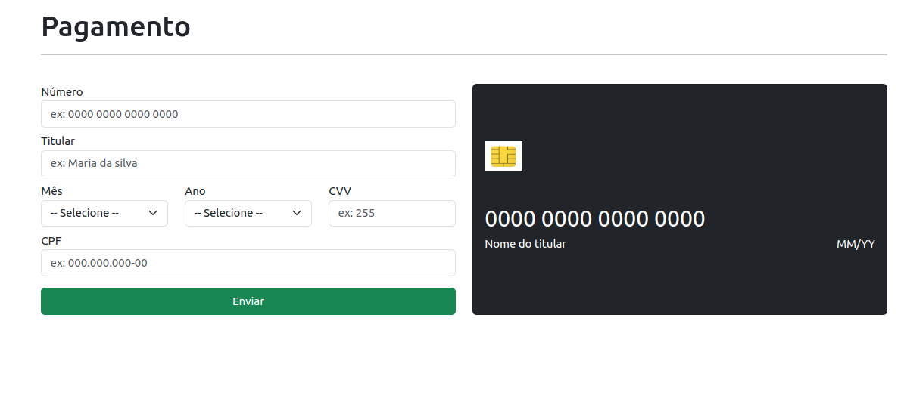

# Credit_card
Aplicação interativa que aplica meus conhecimentos de mascaramento e validação de inputs

  <a href="#tecnologias">Tecnologias</a>&nbsp;&nbsp;&nbsp;|&nbsp;&nbsp;&nbsp;
  <a href="#projeto">Projeto</a>&nbsp; | &nbsp;&nbsp;&nbsp;
  <a href="#telas">Telas</a>

 

---

## Tecnologias

Esse projeto foi desenvolvido com as seguintes tecnologias:

---

## Projeto

Visando uma validação adequada para o banco de dados, apliquei algumas validações via form front end para que possa limitar possiveis problemas nos dados salvos no banco

---

## Tela

 

